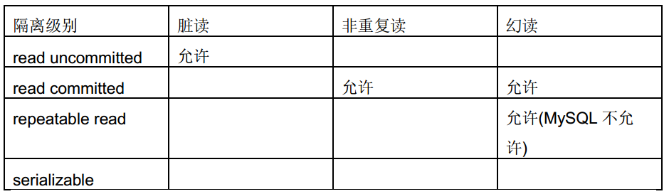

<details>
 <summary><b>索引相关</b></summary>

##### 什么是索引?
>索引是一种数据结构,可以帮助我们快速的进行数据的查找.

##### 索引是个什么样的数据结构呢?
>索引的数据结构和具体存储引擎的实现有关, 在MySQL中使用较多的索引有Hash索引,B+树索引等,而我们经常使用的InnoDB存储引擎的默认索引实现为:B+树索引.

##### 索引对数据库系统的负面影响
>虽然索引对于数据库的查询提高了效率，但一定程度上增加了空间的占用，同时写入的速度降低了不少，和原有写入数据相比较，多了一步去维护索引的操作

#### 主键、外键和唯一索引的区别
	定义：
	* 主键：唯一标识一条记录，不能有重复的，不允许为空
	* 外键：表的外键是另一表的主键, 外键可以有重复的, 可以是空值
	* 索引：该字段没有重复值，但可以有空值

	作用：
	* 主键：用来保证数据完整性
	* 外键：用来和其他表建立联系用的
	* 索引：是提高查询排序的速度

	个数：
	* 主键：主键只能有一个
	* 外键：一个表可以有多个外键
	* 索引：一个表可以有多个唯一索引

##### Hash索引和B+树所有有什么区别或者说优劣呢?

首先要知道Hash索引和B+树索引的底层实现原理:
>hash索引底层就是hash表,进行查找时,调用一次hash函数就可以获取到相应的键值,之后进行回表查询获得实际数据.B+树底层实现是多路平衡查找树.对于每一次的查询都是从根节点出发,查找到叶子节点方可以获得所查键值,然后根据查询判断是否需要回表查询数据.

那么可以看出他们有以下的不同:
>hash索引进行等值查询更快(一般情况下),但是却无法进行范围查询.

因为在hash索引中经过hash函数建立索引之后,索引的顺序与原顺序无法保持一致,不能支持范围查询.而B+树的的所有节点皆遵循(左节点小于父节点,右节点大于父节点,多叉树也类似),天然支持范围.

* hash索引不支持使用索引进行排序,原理同上.
* hash索引不支持模糊查询以及多列索引的最左前缀匹配.原理也是因为hash函数的不可预测.AAAA和AAAAB的索引没有相关性.
* hash索引任何时候都避免不了回表查询数据,而B+树在符合某些条件(聚簇索引,覆盖索引等)的时候可以只通过索引完成查询.
* hash索引虽然在等值查询上较快,但是不稳定.性能不可预测,当某个键值存在大量重复的时候,发生hash碰撞,此时效率可能极差.而B+树的查询效率比较稳定,对于所有的查询都是从根节点到叶子节点,且树的高度较低.

>因此,在大多数情况下,直接选择B+树索引可以获得稳定且较好的查询速度.而不需要使用hash索引.

##### 上面提到了B+树在满足聚簇索引和覆盖索引的时候不需要回表查询数据,什么是聚簇索引?

>在B+树的索引中,叶子节点可能存储了当前的key值,也可能存储了当前的key值以及整行的数据,这就是聚簇索引和非聚簇索引. 在InnoDB中,只有主键索引是聚簇索引,如果没有主键,则挑选一个唯一键建立聚簇索引.如果没有唯一键,则隐式的生成一个键来建立聚簇索引.
当查询使用聚簇索引时,在对应的叶子节点,可以获取到整行数据,因此不用再次进行回表查询.

##### 非聚簇索引一定会回表查询吗?

>不一定,这涉及到查询语句所要求的字段是否全部命中了索引,如果全部命中了索引,那么就不必再进行回表查询.
举个简单的例子,假设我们在员工表的年龄上建立了索引,那么当进行`select age from employee where age < 20`的查询时,在索引的叶子节点上,已经包含了age信息,不会再次进行回表查询.

##### 在建立索引的时候,都有哪些需要考虑的因素呢?

>建立索引的时候一般要考虑到字段的使用频率,经常作为条件进行查询的字段比较适合.如果需要建立联合索引的话,还需要考虑联合索引中的顺序.此外也要考虑其他方面,比如防止过多的所有对表造成太大的压力.这些都和实际的表结构以及查询方式有关.MySQL可以使用多个字段同时建立一个索引,叫做联合索引.在联合索引中,如果想要命中索引,需要按照建立索引时的字段顺序挨个使用,否则无法命中索引.

##### 联合索引是什么?为什么需要注意联合索引中的顺序?

>MySQL可以使用多个字段同时建立一个索引,叫做联合索引.在联合索引中,如果想要命中索引,需要按照建立索引时的字段顺序挨个使用,否则无法命中索引.

具体原因为:

>MySQL使用索引时需要索引有序,假设现在建立了"name,age,school"的联合索引,那么索引的排序为: 先按照name排序,如果name相同,则按照age排序,如果age的值也相等,则按照school进行排序.
当进行查询时,此时索引仅仅按照name严格有序,因此必须首先使用name字段进行等值查询,之后对于匹配到的列而言,其按照age字段严格有序,此时可以使用age字段用做索引查找,,,以此类推.因此在建立联合索引的时候应该注意索引列的顺序,一般情况下,将查询需求频繁或者字段选择性高的列放在前面.此外可以根据特例的查询或者表结构进行单独的调整.


##### 创建的索引有没有被使用到?或者说怎么才可以知道这条语句运行很慢的原因?

>MySQL提供了explain命令来查看语句的执行计划,MySQL在执行某个语句之前,会将该语句过一遍查询优化器,之后会拿到对语句的分析,也就是执行计划,其中包含了许多信息. 可以通过其中和索引有关的信息来分析是否命中了索引,例如possilbe_key,key,key_len等字段,分别说明了此语句可能会使用的索引,实际使用的索引以及使用的索引长度.

##### 那么在哪些情况下会发生针对该列创建了索引但是在查询的时候并没有使用呢?

* 使用不等于查询,
* 列参与了数学运算或者函数
* 在字符串like时左边是通配符.类似于'%aaa'.
* 当mysql分析全表扫描比使用索引快的时候不使用索引.
* 当使用联合索引,前面一个条件为范围查询,后面的即使符合最左前缀原则,也无法使用索引.
>以上情况,MySQL无法使用索引.

</details>


<details>
 <summary><b>事务相关</b></summary>

##### (1)、事务的基本要素（ACID）
1. 原子性（Atomicity）：事务开始后所有操作，要么全部做完，要么全部不做，不可能停滞在中间环节。事务执行过程中出错，会回滚到事务开始前的状态，所有的操作就像没有发生一样。也就是说事务是一个不可分割的整体，就像化学中学过的原子，是物质构成的基本单位。
2. 一致性（Consistency）：事务开始前和结束后，数据库的完整性约束没有被破坏 。比如A向B转账，不可能A扣了钱，B却没收到。
3. 隔离性（Isolation）：同一时间，只允许一个事务请求同一数据，不同的事务之间彼此没有任何干扰。比如A正在从一张银行卡中取钱，在A取钱的过程结束前，B不能向这张卡转账。
4. 持久性（Durability）：事务完成后，事务对数据库的所有更新将被保存到数据库，不能回滚。

##### (2)、事物的4种隔离级别

1. 读未提交(read uncommitted)

	>现象：一个事务可以读取到另一个事务未提交的修改。这会带来脏读、幻读、不可重复读问题。（基本没用）


2. 读已提交(read committed)

	>现象：一个事务只能读取另一个事务已经提交的修改。其避免了脏读，但仍然存在不可重复读和幻读问题。


3. 可重复读(repeatable read)

	>现象：同一个事务中多次读取相同的数据返回的结果是一样的。其避免了脏读和不可重复读问题，但幻读依然存在。

4. 串行(serializable)

	>现象：这是最高的隔离级别,可以解决上面提到的所有问题,因为他强制将所以的操作串行执行,这会导致并发性能极速下降,因此也不是很常用.

>mysql默认的事务隔离级别为repeatable-read，不同的隔离级别有不同的现象，并有不同的锁定/并发机制，隔离级别越高，数据库的并发性就越差。

 

1. 脏读：一个事务读取到另一事务未提交的更新数据
2. 不可重复读 : 在同一事务中,多次读取同一数据返回的结果有所不同, 换句话说, 后续读取可以读到另一事务已提交的更新数据. 
3. 可重复读：在同一事务中多次读取数据时, 能够保证所读数据一样, 也就是后续读取不能读到另一事务已提交的更新数据。
4. 幻读：一个事务读到另一个事务已提交的insert数据
>不可重复读重点在于update和delete，而幻读的重点在于insert。

##### (3)、MySQL事务隔离级别的实现原理(重点)
>https://www.linuxidc.com/Linux/2018-01/150610.htm

##### (4)、大佬讲解(重点)
http://tech.it168.com/a2016/0905/2900/000002900122.shtml
https://blog.csdn.net/matt8/article/details/53096405    

</details>


<details>
 <summary><b>表结构设计</b></summary>

1. 为什么要尽量设定一个主键?

	主键是数据库确保数据行在整张表唯一性的保障,即使业务上本张表没有主键,也建议添加一个自增长的ID列作为主键.设定了主键之后,在后续的删改查的时候可能更加快速以及确保操作数据范围安全.

2. 主键使用自增ID还是UUID?

	推荐使用自增ID,不要使用UUID.
	>因为在InnoDB存储引擎中,主键索引是作为聚簇索引存在的,也就是说,主键索引的B+树叶子节点上存储了主键索引以及全部的数据(按照顺序),如果主键索引是自增ID,那么只需要不断向后排列即可,如果是UUID,由于到来的ID与原来的大小不确定,会造成非常多的数据插入,数据移动,然后导致产生很多的内存碎片,进而造成插入性能的下降.

3. 字段为什么要求定义为not null?

	MySQL官网这样介绍:
	>NULL columns require additional space in the rowto record whether their values are NULL. For MyISAM tables, each NULL columntakes one bit extra, rounded up to the nearest byte.
	null值会占用更多的字节,且会在程序中造成很多与预期不符的情况.

4. 如果要存储用户的密码散列,应该使用什么字段进行存储?

	密码散列,盐,用户身份证号等固定长度的字符串应该使用char而不是varchar来存储,这样可以节省空间且提高检索效率.


5. 三个范式

	1. 第一范式: 每个列都不可以再拆分. 
	2. 第二范式: 非主键列完全依赖于主键,而不能是依赖于主键的一部分. 
	3. 第三范式: 非主键列只依赖于主键,不依赖于其他非主键.
	>在设计数据库结构的时候,要尽量遵守三范式,如果不遵守,必须有足够的理由.比如性能. 事实上我们经常会为了性能而妥协数据库的设计.
	比如我们表比较多，需要关联时，但我们的A表只需要关联B表的一个字段，而且每次都需要关联查询你，这时我们可以采用A表放置一个冗余字段来存B表的那个字段。这个操作其实就是一个反范式的


</details>


<details>
 <summary><b>锁相关</b></summary>

##### (1)、类别

	从锁的类别上来讲,有共享锁和排他锁.
	共享锁: 又叫做读锁. 当用户要进行数据的读取时,对数据加上共享锁.共享锁可以同时加上多个.
	排他锁: 又叫做写锁. 当用户要进行数据的写入时,对数据加上排他锁.排他锁只可以加一个,他和其他的排他锁,共享锁都相斥.
	用上面的例子来说就是用户的行为有两种,一种是来看房,多个用户一起看房是可以接受的. 一种是真正的入住一晚,在这期间,无论是想入住的还是想看房的都不可以.
	锁的粒度取决于具体的存储引擎,InnoDB实现了行级锁,页级锁,表级锁.
	他们的加锁开销从大到小,并发能力也是从大到小.

##### (2)、实现原理

	跟存储的结构有关，会在索引上加锁（就跟文件锁一样，有个锁标志），如果没有锁引，那就会锁表
	另外锁会有一个范围，间隙锁
	https://www.cnblogs.com/luyucheng/p/6297752.html


</details>


<details>
 <summary><b>select * from table where (ID = 10) or (ID = 32) or (ID = 22) 让结果按10, 32, 22的顺序检索出来？</b></summary>

```
Select *
from user_info
Where (ID IN (10, 32, 22))

order BY FIND_IN_SET(ID, '10, 32, 22')
 ```

</details>


<details>
 <summary><b>MySQL中myisam与innodb的区别，至少5点</b></summary>

1. InnoDB支持事物，而MyISAM不支持事物
2. InnoDB支持行级锁，而MyISAM支持表级锁
3. InnoDB支持MVCC, 而MyISAM不支持
4. InnoDB支持外键，而MyISAM不支持
5. InnoDB不支持全文索引，而MyISAM支持。
6. InnoDB不能通过直接拷贝表文件的方法拷贝表到另外一台机器， myisam 支持
7. InnoDB表支持多种行格式， myisam 不支持
8. InnoDB是索引组织表， myisam 是堆表

</details>


<details>
 <summary><b>myisam与innodb select  count(*)哪个更快，为什么</b></summary>

>myisam更快，因为myisam内部维护了一个计数器，可以直接调取。

</details>


<details>
 <summary><b>myisam与innodb 的索引的实现方式</b></summary>

>都是 B+树索引， Innodb 是索引组织表， myisam 是堆表， 索引组织表和堆表的区别要熟悉

</details>


<details>
 <summary><b>关心过业务系统里面的sql耗时吗?统计过慢查询吗?对慢查询都怎么优化过?</b></summary>

1. 首先分析语句,看看是否load了额外的数据,可能是查询了多余的行并且抛弃掉了,可能是加载了许多结果中并不需要的列,对语句进行分析以及重写.
2. 分析语句的执行计划,然后获得其使用索引的情况,之后修改语句或者修改索引,使得语句可以尽可能的命中索引.
3. 如果对语句的优化已经无法进行,可以考虑表中的数据量是否太大,如果是的话可以进行横向或者纵向的分表.

</details>


<details>
 <summary><b>横向分表和纵向分表,可以分别举一个适合他们的例子吗?</b></summary>

>横向分表是按行分表.假设我们有一张用户表,主键是自增ID且同时是用户的ID.数据量较大,有1亿多条,那么此时放在一张表里的查询效果就不太理想.我们可以根据主键ID进行分表,无论是按尾号分,或者按ID的区间分都是可以的. 假设按照尾号0-99分为100个表,那么每张表中的数据就仅有100w.这时的查询效率无疑是可以满足要求的.

>纵向分表是按列分表.假设我们现在有一张文章表.包含字段id-摘要-内容.而系统中的展示形式是刷新出一个列表,列表中仅包含标题和摘要,当用户点击某篇文章进入详情时才需要正文内容.此时,如果数据量大,将内容这个很大且不经常使用的列放在一起会拖慢原表的查询速度.我们可以将上面的表分为两张.id-摘要,id-内容.当用户点击详情,那主键再来取一次内容即可.而增加的存储量只是很小的主键字段.代价很小.

</details>


<details>
 <summary><b>MySQL中的varchar和char有什么区别.</b></summary>

	char是一个定长字段,假如申请了char(10)的空间,那么无论实际存储多少内容.该字段都占用10个字符,而varchar是变长的,也就是说申请的只是最大长度,占用的空间为实际字符长度+1,最后一个字符存储使用了多长的空间.

	在检索效率上来讲,char > varchar,因此在使用中,如果确定某个字段的值的长度,可以使用char,否则应该尽量使用varchar.例如存储用户MD5加密后的密码,则应该使用char.

</details>


<details>
 <summary><b>varchar(10)和int(10)代表什么含义?</b></summary>

	varchar的10代表了申请的空间长度,也是可以存储的数据的最大长度,而int的10只是代表了展示的长度,不足10位以0填充.也就是说,int(1)和int(10)所能存储的数字大小以及占用的空间都是相同的,只是在展示时按照长度展示.

</details>


<details>
 <summary><b>锁的优化策略</b></summary>

	 优化，也就是最小力度的锁我们的数据，也就是行锁，InnoDB的行锁其实是加在索引字段的，避免行锁的升级为表锁，再就是我们尽量避免间隙锁，尽量避免我们的范围修改，如果真的必须范围修改，那么我应该尽可能的缩小到最小的范围。

</details>


<details>
 <summary><b>QL注入的原理是什么？如何防止SQL注入</b></summary>

	通常都是初级程序员写的初级代码,未过滤用户输入导致的,现代框架的ORM一般都做过相应处理,如果需要自己处理,有两种解决方式:
	1. 转义用户输入(htmlentities/htmlspecialchars),用mysql_real_escape_string方法过滤SQL语句的参数
	2. 预编译sql    (最佳方式)

</details>


<details>
 <summary><b>Redis 事务（未解决）</b></summary>


</details>


<details>
 <summary><b>mysql中字段类型各占几个字节：smallint、int、bigint、datetime、varchar(8)</b></summary>

	* TINYINT——一个微小的整数，支持 -128到127(SIGNED)，0到255(UNSIGNED)，需要1个字节存储 
	* BIT——同TINYINT(1) 
	* BOOL——同TINYINT(1) 
	* SMALLINT——一个小整数，支持 -32768到32767(SIGNED)，0到65535(UNSIGNED)，需要2个字节存储 MEDIUMINT——一个中等整数，支持 -8388608到8388607(SIGNED)，0到16777215(UNSIGNED)，需要3个字节存储 
	* INT——一个整数，支持 -2147493648到2147493647(SIGNED)，0到4294967295(UNSIGNED)，需要4个字节存储 
	* INTEGER——同INT 
	* BIGINT——一个大整数，支持 -9223372036854775808到9223372036854775807(SIGNED)，0到18446744073709551615(UNSIGNED)，需要8个字节存储 
	* FLOAT(precision)——一个浮点数。precision<=24用于单精度浮点数；precision在25和53之间，用于又精度 浮点数。FLOAT(X)与相诮的FLOAT和DOUBLE类型有差相同的范围，但是没有定义显示尺寸和小数位数。在MySQL3.23之前，这不是一个 真的浮点值，且总是有两位小数。MySQL中的所有计算都用双精度，所以这会带来一些意想不到的问题。 
	* FLOAT——一个小的菜单精度浮点数。支持 -3.402823466E+38到-1.175494351E-38，0和1.175494351E-38 to 3.402823466E+38，需要4个字节存储。如果是UNSIGNED，正数的范围保持不变，但负数是不允许的。 
	* DOUBLE——一个双精度浮点数。支持 -1.7976931348623157E+308到-2.2250738585072014E-308，0和2.2250738585072014E- 308到1.7976931348623157E+308。如果是FLOAT，UNSIGNED不会改变正数范围，但负数是不允许的。 
	* DOUBLE PRECISION——同DOUBLE 
	* REAL——同DOUBLE 
	* DECIMAL——将一个数像字符串那样存储，每个字符占一个字节 
	* DEC——同DECIMAL 
	* NUMERIC——同DECIMAL 

	字符串列类型:char、varchar、nvarchar 
	字符串列类型用于存储任何类型的字符数据，如名字、地址或者报纸文章。下面是MySQL中可用的字符串列类型 
	* CHAR——字符。固定长度的字串，在右边补齐空格，达到指定的长度。支持从0到155个字符。搜索值时，后缀的空格将被删除。 
	* VARCHAR——可变长的字符。一个可变长度的字串，其中的后缀空格在存储值时被删除。支持从0到255字符 
	* TINYBLOB——微小的二进制对象。支持255个字符。需要长度+1字节的存储。与TINYTEXT一样，只不过搜索时是区分大小写的。(0.25KB) 
	* TINYTEXT——支持255个字符。要求长度+1字节的存储。与TINYBLOB一样，只不过搜索时会忽略大小写。(0.25KB) 
	* BLOB——二进制对象。支持65535个字符。需要长度+2字节的存储。 (64KB) 
	* TEXT——支持65535个字符。要求长度+2字节的存储。 (64KB) 
	* MEDIUMBLOB——中等大小的二进制对象。支持16777215个字符。需要长度+3字节的存储。 (16M) 
	* MEDIUMTEXT——支持16777215个字符。需要长度+3字节的存储。 (16M) 
	* LONGBLOB——大的的二进制对象。支持4294967295个字符。需要长度+4字节的存储。 (4G) 
	* LONGTEXT——支持4294967295个字符。需要长度+4字节的存储。(4G) 
	* ENUM——枚举。只能有一个指定的值，即NULL或""，最大有65535个值 
	* SET——一个集合。可以有0到64个值，均来自于指定清单. 

	日期和时间列类型 
	　日期和时间列类型用于处理时间数据，可以存储当日的时间或出生日期这样的数据。格式的规定：Y表示年、M（前M）表示月、D表示日、H表示小时、M（后M）表示分钟、S表示秒。下面是MySQL中可用的日期和时间列类型 
	* DATETIME——格式：'YYYY-MM-DD HH:MM:SS'，范围：'1000-01-01 00:00:00'到'9999-12-31 23:59:59' 
	* DATE——格式：'YYYY-MM-DD'，范围：'1000-01-01'到'9999-12-31' 
	* TIMESTAMP——格式：'YYYYMMDDHHMMSS'、'YYMMDDHHMMSS'、'YYYYMMDD'、'YYMMDD'，范围：'1970-01-01 00:00:00'到'2037-01-01 00:00:00' 
	* TIME——格式：'HH:MM:SS' 
	* YEAR——格式：'YYYY，范围：'1901'到'2155'

</details>


<details>
 <summary><b>Redis 数据类型</b></summary>

	1. string 字符串类型；
		string 是 Redis 的最基本数据类型。可以把它理解为 Mc 中 key 对应的 value 类型。string 类型是二进制安全的，即 string 中可以包含任何数据。
		Redis 中的普通 string 采用 raw encoding 即原始编码方式，该编码方式会动态扩容，并通过提前预分配冗余空间，来减少内存频繁分配的开销。
		在字符串长度小于 1MB 时，按所需长度的 2 倍来分配，超过 1MB，则按照每次额外增加 1MB 的容量来预分配。
		Redis 中的数字也存为 string 类型，但编码方式跟普通 string 不同，数字采用整型编码，字符串内容直接设为整数值的二进制字节序列。
		在存储普通字符串，序列化对象，以及计数器等场景时，都可以使用 Redis 的字符串类型，字符串数据类型对应使用的指令包括 set、get、mset、incr、decr 等。

	2. list 列表类型；
		Redis 的 list 列表，是一个快速双向链表，存储了一系列的 string 类型的字串值。list 中的元素按照插入顺序排列。插入元素的方式，可以通过 lpush 将一个或多个元素插入到列表的头部，也可以通过 rpush 将一个或多个元素插入到队列尾部，还可以通过 lset、linsert 将元素插入到指定位置或指定元素的前后。
		list 列表的获取，可以通过 lpop、rpop 从对头或队尾弹出元素，如果队列为空，则返回 nil。还可以通过 Blpop、Brpop 从队头/队尾阻塞式弹出元素，如果 list 列表为空，没有元素可供弹出，则持续阻塞，直到有其他 client 插入新的元素。这里阻塞弹出元素，可以设置过期时间，避免无限期等待。最后，list 列表还可以通过 LrangeR 获取队列内指定范围内的所有元素。Redis 中，list 列表的偏移位置都是基于 0 的下标，即列表第一个元素的下标是 0，第二个是 1。偏移量也可以是负数，倒数第一个是 -1，倒数第二个是 -2，依次类推。
		list 列表，对于常规的 pop、push 元素，性能很高，时间复杂度为 O(1)，因为是列表直接追加或弹出。但对于通过随机插入、随机删除，以及随机范围获取，需要轮询列表确定位置，性能就比较低下了。
		feed timeline 存储时，由于 feed id 一般是递增的，可以直接存为 list，用户发表新 feed，就直接追加到队尾。另外消息队列、热门 feed 等业务场景，都可以使用 list 数据结构。
		操作 list 列表时，可以用 lpush、lpop、rpush、rpop、lrange 来进行常规的队列进出及范围获取操作，在某些特殊场景下，也可以用 lset、linsert 进行随机插入操作，用 lrem 进行指定元素删除操作；最后，在消息列表的消费时，还可以用 Blpop、Brpop 进行阻塞式获取，从而在列表暂时没有元素时，可以安静的等待新元素的插入，而不需要额外持续的查询。

	3. set 集合类型；
		set 是 string 类型的无序集合，set 中的元素是唯一的，即 set 中不会出现重复的元素。Redis 中的集合一般是通过 dict 哈希表实现的，所以插入、删除，以及查询元素，可以根据元素 hash 值直接定位，时间复杂度为 O(1)。
		对 set 类型数据的操作，除了常规的添加、删除、查找元素外，还可以用以下指令对 set 进行操作。
		sismember 指令判断该 key 对应的 set 数据结构中，是否存在某个元素，如果存在返回 1，否则返回 0；
		sdiff 指令来对多个 set 集合执行差集；
		sinter 指令对多个集合执行交集；
		sunion 指令对多个集合执行并集；
		spop 指令弹出一个随机元素；
		srandmember 指令返回一个或多个随机元素。
		set 集合的特点是查找、插入、删除特别高效，时间复杂度为 O(1)，所以在社交系统中，可以用于存储关注的好友列表，用来判断是否关注，还可以用来做好友推荐使用。另外，还可以利用 set 的唯一性，来对服务的来源业务、来源 IP 进行精确统计。

	4. sorted set 有序集合类型；
		Redis 中的 sorted set 有序集合也称为 zset，有序集合同 set 集合类似，也是 string 类型元素的集合，且所有元素不允许重复。
		但有序集合中，每个元素都会关联一个 double 类型的 score 分数值。有序集合通过这个 score 值进行由小到大的排序。有序集合中，元素不允许重复，但 score 分数值却允许重复。
		有序集合除了常规的添加、删除、查找元素外，还可以通过以下指令对 sorted set 进行操作。
		zscan 指令：按顺序获取有序集合中的元素；
		zscore 指令：获取元素的 score 值；
		zrange指令：通过指定 score 返回指定 score 范围内的元素；
		在某个元素的 score 值发生变更时，还可以通过 zincrby 指令对该元素的 score 值进行加减。
		通过 zinterstore、zunionstore 指令对多个有序集合进行取交集和并集，然后将新的有序集合存到一个新的 key 中，如果有重复元素，重复元素的 score 进行相加，然后作为新集合中该元素的 score 值。
		sorted set 有序集合的特点是：
		所有元素按 score 排序，而且不重复；
		查找、插入、删除非常高效，时间复杂度为 O(1)。
		因此，可以用有序集合来统计排行榜，实时刷新榜单，还可以用来记录学生成绩，从而轻松获取某个成绩范围内的学生名单，还可以用来对系统统计增加权重值，从而在 dashboard 实时展示。

	5. hash 类型；
		Redis 中的哈希实际是 field 和 value 的一个映射表。
		hash 数据结构的特点是在单个 key 对应的哈希结构内部，可以记录多个键值对，即 field 和 value 对，value 可以是任何字符串。而且这些键值对查询和修改很高效。
		所以可以用 hash 来存储具有多个元素的复杂对象，然后分别修改或获取这些元素。hash 结构中的一些重要指令，包括：hmset、hmget、hexists、hgetall、hincrby 等。
		hmset 指令批量插入多个 field、value 映射；
		hmget 指令获取多个 field 对应的 value 值；
		hexists 指令判断某个 field 是否存在；
		如果 field 对应的 value 是整数，还可以用 hincrby 来对该 value 进行修改。

	6. bitmap 位图类型； 
		Redis 中的 bitmap 位图是一串连续的二进制数字，底层实际是基于 string 进行封装存储的，按 bit 位进行指令操作的。bitmap 中每一 bit 位所在的位置就是 offset 偏移，可以用 setbit、bitfield 对 bitmap 中每个 bit 进行置 0 或置 1 操作，也可以用 bitcount 来统计 bitmap 中的被置 1 的 bit 数，还可以用 bitop 来对多个 bitmap 进行求与、或、异或等操作。
		bitmap 位图的特点是按位设置、求与、求或等操作很高效，而且存储成本非常低，用来存对象标签属性的话，一个 bit 即可存一个标签。可以用 bitmap，存用户最近 N 天的登录情况，每天用 1 bit，登录则置 1。个性推荐在社交应用中非常重要，可以对新闻、feed 设置一系列标签，如军事、娱乐、视频、图片、文字等，用 bitmap 来存储这些标签，在对应标签 bit 位上置 1。对用户，也可以采用类似方式，记录用户的多种属性，并可以很方便的根据标签来进行多维度统计。bitmap 位图的重要指令包括：setbit、 getbit、bitcount、bitfield、 bitop、bitpos 等。

	7. geo 地理位置类型；
		在移动社交时代，LBS 应用越来越多，比如微信、陌陌中附近的人，美团、大众点评中附近的美食、电影院，滴滴、优步中附近的专车等。要实现这些功能，就得使用地理位置信息进行搜索。地球的地理位置是使用二维的经纬度进行表示的，我们只要确定一个点的经纬度，就可以确认它在地球的位置。
		Redis 在 3.2 版本之后增加了对 GEO 地理位置的处理功能。Redis 的 GEO 地理位置本质上是基于 sorted set 封装实现的。在存储分类 key 下的地理位置信息时，需要对该分类 key 构建一个 sorted set 作为内部存储结构，用于存储一系列位置点。
		在存储某个位置点时，首先利用 Geohash 算法，将该位置二维的经纬度，映射编码成一维的 52 位整数值，将位置名称、经纬度编码 score 作为键值对，存储到分类 key 对应的 sorted set 中。
		需要计算某个位置点 A 附近的人时，首先以指定位置 A 为中心点，以距离作为半径，算出 GEO 哈希 8 个方位的范围， 然后依次轮询方位范围内的所有位置点，只要这些位置点到中心位置 A 的距离在要求距离范围内，就是目标位置点。轮询完所有范围内的位置点后，重新排序即得到位置点 A 附近的所有目标。
		使用 geoadd，将位置名称（如人、车辆、店名）与对应的地理位置信息添加到指定的位置分类 key 中；
		使用 geopos 方便地查询某个名称所在的位置信息；
		使用 georadius 获取指定位置附近，不超过指定距离的所有元素；
		使用 geodist 来获取指定的两个位置之间的距离。
		这样，是不是就可以实现，找到附近的餐厅，算出当前位置到对应餐厅的距离，这样的功能了？
		Redis GEO 地理位置，利用 Geohash 将大量的二维经纬度转一维的整数值，这样可以方便的对地理位置进行查询、距离测量、范围搜索。但由于地理位置点非常多，一个地理分类 key 下可能会有大量元素，在 GEO 设计时，需要提前进行规划，避免单 key 过度膨胀。
		Redis 的 GEO 地理位置数据结构，应用场景很多，比如查询某个地方的具体位置，查当前位置到目的地的距离，查附近的人、餐厅、电影院等。GEO 地理位置数据结构中，重要指令包括 geoadd、geopos、geodist、georadius、georadiusbymember 等。

	8. HyperLogLog 基数统计类型。
		Redis 的 hyperLogLog 是用来做基数统计的数据类型，当输入巨大数量的元素做统计时，只需要很小的内存即可完成。HyperLogLog 不保存元数据，只记录待统计元素的估算数量，这个估算数量是一个带有 0.81% 标准差的近似值，在大多数业务场景，对海量数据，不足 1% 的误差是可以接受的。
		Redis 的 HyperLogLog 在统计时，如果计数数量不大，采用稀疏矩阵存储，随着计数的增加，稀疏矩阵占用的空间也会逐渐增加，当超过阀值后，则改为稠密矩阵，稠密矩阵占用的空间是固定的，约为12KB字节。
		通过 hyperLoglog 数据类型，你可以利用 pfadd 向基数统计中增加新的元素，可以用 pfcount 获得 hyperLogLog 结构中存储的近似基数数量，还可以用 hypermerge 将多个 hyperLogLog 合并为一个 hyperLogLog 结构，从而可以方便的获取合并后的基数数量。
		hyperLogLog 的特点是统计过程不记录独立元素，占用内存非常少，非常适合统计海量数据。在大中型系统中，统计每日、每月的 UV 即独立访客数，或者统计海量用户搜索的独立词条数，都可以用 hyperLogLog 数据类型来进行处理。

</details>


<details>
 <summary><b></b></summary>


</details>