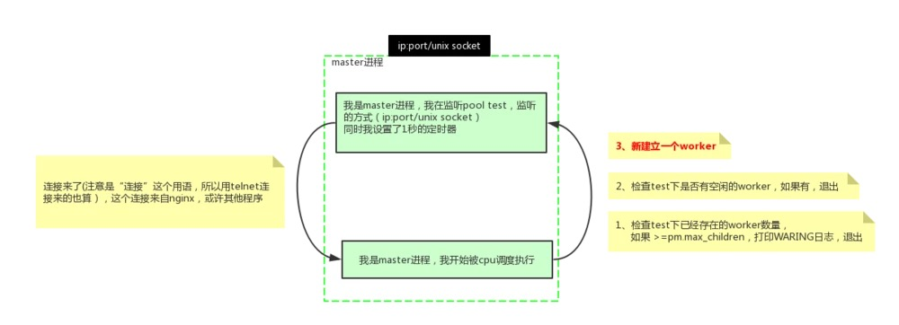

<details>
 <summary><b>PHP中几个输出函数echo，print()，print_r()，sprintf()，var_dump()的区别</b></summary>


1. echo：是语句不是函数，没有返回值，可输出多个变量值，不需要圆括号。不能输出数组和对象，只能打印简单类型(如int,string)。
2. print：是语句不是函数，有返回值 1 ，只能输出一个变量，不需要圆括号。不能输出数组和对象，只能打印简单类型(如int,string)。
3. print_r：是函数，可以打印复合类型，例如：stirng、int、float、array、object等，输出array时会用结构表示，而且可以通过print_r($str,true)来使print_r不输出而返回print_r处理后的值
4. printf：是函数，把文字格式化以后输出（参看C语言）
5. sprintf：是函数，跟printf相似，但不打印，而是返回格式化后的文字（该函数把格式化的字符串写写入一个变量中，而不是输出来），其    他的与printf一样。
6. var_dump()：函数，输出变量的内容、类型或字符串的内容、类型、长度。常用来调试。

</details>


<details>
 <summary><b>不用新变量直接交换现有两个变量的值</b></summary>

方法一： 用list()
```
   a=10;b = 25;
   list(a,b)=array(b,a);
   echo a.′/′.b;//25/10
```
方法二：用传值方式加&符
```
  function swap(&a,&b)
  {
      $c = '';
      c=a;
      a=b;
      b=c;
  }

  a=25;b = 35;
  swap(a,b);
  echo a.′/′.b;
```

方法三：使用数组分割
```
    a="123";b = "456";
    b=a."#".b;
    b = explode("#",b);a = b[1];b = b[0];echoa."-".$b;
```
 

方法四：使用异或运算
```
    a="fsdfds";b = "xiaorui";
    a=a^b;b = b^a;
    a=a^b;echo a."-".$b;
```
</details>


<details>
 <summary><b>heredoc</b></summary>

>Heredoc在正规的PHP文档中和技术书籍中一般没有详细讲述。他是一种Perl风格的字符串输出技术。使用heredoc技术可以实现界面与代码的准分离，比如phpwind模板。
heredoc的语法是用”<<<”加上自己定义成对的标签，在标签范围內的文字视为一个字符串

规则如下：

1. 以<<<End开始标记开始，以End结束标记结束，结束标记必须顶头写，不能有缩进和空格，且在结束标记末尾要有分号 。开始标记和开始标记相同，比如常用大写的EOT、EOD、EOF来表示，也可以使用其他标记，只要保证开始标记和结束标记不在正文中出现就行。

2. 位于开始标记和结束标记之间的变量可以被正常解析，但是函数则不可以。在heredoc中，变量不需要用连接符 . 或 , 来拼接，比如：
```
$a=2;
$b= <<<EOF
  "zyf"$a
  "zyf"
EOF;
echo $b; //结果连同双引号一起输出："zyf"2 "zyf"
```
3. heredoc常用在输出包含大量HTML语法文档的时候。他要比传统的echo输出精炼很多，如下所示：

```
function getHtml()
{
    echo "<html>";
    echo "<head><title>Title</title></head>";
    echo "<body>Content</body>";
    echo "</html>;
}

function getHtml()
{
echo <<<EOT
      <html>
      <head><title>Title</title></head>
      <body>Content</body>
      </html>
EOT;
}
```
</details>


<details>
 <summary><b>写个函数来解决多线程同时读写一个文件的问题</b></summary>

一般的方案：

```
//fopen():打开文件或者 URL，返回resource类型数据 。
$fp = fopen('./tmp/lock.txt', 'a+');
if (flock($fp, LOCK_EX)) {//取得独占锁定
    fwrite($fp, "Write something here\n");
    flock($fp, LOCK_UN);// 释放锁定
} else {
    echo "Couldn't lock the file !";
}
fclose($fp);
```
>但在PHP中，flock似乎工作的不是那么好！在多并发情况下，似乎是经常独占资源，不即时释放，或者是根本不释放，造成死锁，从而使服务器的cpu占用很高，甚至有时候会让服务器彻底死掉。

方案二：对文件进行加锁时，设置一个超时时间.
```
$fileName = './tmp/lock.txt';
if ($fp = fopen($fileName, 'a+')) {
    $startTime = microtime();
    while ((microtime() - $startTime) < 1000) {
        $canWrite = flock($fp, LOCK_EX);
        if (!$canWrite) {
            usleep(round(rand(0, 100) * 1000));
        } else {
            fwrite($fp, "Write something here\n");
            break;
        }
    }
    fclose($fp);
}
```
> 超时设置为1ms，如果这里时间内没有获得锁，就反复获得，直接获得到对文件操作权为止，当然。如果超时限制已到，就必需马上退出，让出锁让其它进程来进行操作。

</details>


<details>
 <summary><b>禁掉cookie的session使用方案，设置session过期的方法，对应函数</b></summary>

1. 设置php.ini的session.use_trans_sid = 1或者打开enable-trans-sid选项，让PHP自动跨页传递session id。
2. 手动通过URL传值, 隐藏表单传递session id。

```
  session_start();
  $_SESSION[’var1’]="源码爱好者";
  $sn = session_id();
  $url="<a href=".""s2.php?s=".$sn."">下一页</a>";
  echo $url;
  ```
  ```
  session_id($_GET[’s’]);
  session_start();
  echo "传递的session变量var1的值为：".$_SESSION[’var1’];
```

3. 用文件、数据库等形式保存session_id,在跨页过程中手动调用。
```
  $name=$_POST[’name’];
  $pass=$_POST[’pass’];

  session_start();
  $_SESSION[’user’]= $name;
  $psid=session_id();
  $fp=fopen("e:\tmp\phpsid.txt","w+";
  fwrite($fp,$psid);
  fclose($fp);
  echo "已登录<br>";
```
```
  $fp=fopen("e:\tmp\phpsid.txt","r";
  $sid=fread($fp,1024);
  fclose($fp);
  session_id($sid);
  session_start();
  if(isset($_SESSION[’user’]) && $_SESSION[’user’]="laogong" {
  echo "已登录!";
```

>Session过期时间设定:
```
ini_set('session.gc_maxlifetime', 3600); //设置时间 
ini_get('session.gc_maxlifetime');//得到ini中设定值 
```

</details>


<details>
 <summary><b>PHP魔术方法和魔术常量</b></summary>

##### 魔术常量

1. `__LINE__`
返回文件中的当前行号。
2. `__FILE__`
　　返回文件的完整路径和文件名。如果用在包含文件中，则返回包含文件名。自PHP4.0.2 起，__FILE__总是包含一个绝对路径，而在此之前的版本有时会包含一个相对路径。
3. `__FUNCTION__`
　　返回函数名称(PHP4.3.0 新加)。自PHP5 起本常量返回该函数被定义时的名字(区分大小写)。在PHP4 中该值总是小写字母的。
4. `__CLASS__`
　　返回类的名称(PHP4.3.0 新加)。自PHP5 起本常量返回该类被定义时的名字(区分大小写)。在PHP4 中该值总是小写字母的。
5. `__METHOD__`
　　返回类的方法名(PHP5.0.0 新加)。返回该方法被定义时的名字(区分大小写)。

##### Class魔术方法
>魔术方法是PHP面向对象中很有用特性。它们在特定的情况下被触发，都是以双下划线开头，可以理解为钩子函数，利用模式方法可以轻松实现PHP面向对象中重载（Overloading即动态创建类属性和方法）。魔术方法很多还是成对出现的，以下列出目前PHP中所有的模式方法。
1. __construct，__destruct
__constuct构建对象的时被调用；
__destruct明确销毁对象或脚本结束时被调用；
2. __get，__set
__set当给不可访问或不存在属性赋值时被调用
__get读取不可访问或不存在属性时被调用
3. __isset，__unset
__isset对不可访问或不存在的属性调用isset()或empty()时被调用
__unset对不可访问或不存在的属性进行unset时被调用
4. __call，__callStatic
__call调用不可访问或不存在的方法时被调用
__callStatic调用不可访问或不存在的静态方法时被调用
5. __sleep，__wakeup
__sleep当使用serialize时被调用，当你不需要保存大对象的所有数据时很有用
__wakeup当使用unserialize时被调用，可用于做些对象的初始化操作
6. __clone
进行对象clone时被调用，用来调整对象的克隆行为
7. __toString
当一个类被转换成字符串时被调用
8. __invoke
当以函数方式调用对象时被调用
9. __set_state
当调用var_export()导出类时，此静态方法被调用。用__set_state的返回值做为var_export的返回值。
10. __debuginfo
当调用var_dump()打印对象时被调用（当你不想打印所有属性）适用于PHP5.6版本

```
  class Animal{
  }
  $m = new Animal(); //__construct()被调用
  $m->not_exist_property = test; //__set()被调用
  echo $m->not_exist_property;//__get()被调用
  $m->abc(1,2,3); //__call()被调用
  echo isset($m->not_exist_property); //__isset()被调用，返回bool值
  unset($m->not_exist_property); //__unset()被调用
  echo $tmp = serialize($m); //__sleep()被调用
  unserialize($tmp); //__wakeup()被调用
  $m1 = clone $m; //__clone()被调用，对象默认是引用传递，使用clone关键词则可实现对象复制
  $m(); //__invoke() 已函数调用类
  eval( '$m2 = ' . var_export ( $m , true ) . ';' );
  var_dump($m2);
  var_dump($m);
  //最后__destruct()被调用
```

</details>


<details>
 <summary><b>PHP缓存技术有哪些? tp是局部还是完全缓存?</b></summary>

1. 全页面静态化缓存：将页面全部生成为HTML静态页面，用户访问时直接访问静态页面，不走PHP服务器的解析流程。此种方式在CMS系统中比较常见，如dedecms。
实现方法：输出缓存
ob_start()--打开“输出控制缓冲”;
some code --要运行的代码;
$content=ob_get_contents()--返回“输出缓冲区的内容”;
some code --使用file_put_contents()等函数将返回的数据写入HTML文件;
ob_clearn()--清空“输出缓冲区”;

2. 页面部分缓存：将页面中不常变动的部分进行静态化缓存，而经常变化的部分不缓存，最后组装在一起显示；可以使用类似ob_get_contents()的方式实现，也可以利用类似ESI之类的页面片段缓存策略，使其用来做动态页面中相对静态的片段部分的缓存。该缓存方式常用与商城中的商品页。

3. 数据缓存：缓存数据的一种方式。比如，商城中的某个商品信息，当用商品id去请求时，就会得出包括店铺信息,商品信息等数据，此时就可以将这些 数据缓存到一个php文件中，文件名包含商品id来建一个唯一标示；下一次有人想查看这个商品时，首先就直接调这个文件里面的信息，而不用再去数据库查 询；其实缓存文件中缓存的就是一个php数组之类；Ecmall商城系统里面就用了这种方式；

4. 查询缓存：根据查询来进行缓存。将查询得到的数据缓存在一个文件中，下次遇到相同的查询时，就直接先从这个文件里面调数据，不再去查数据库；但此处的缓存文件名可能就需要以查询语句为基点来建立唯一标示.

>注意：以上几种缓存方式都需要对缓存的文件设置一个有效时间，在这个时间内，相同的访问会先取缓存文件的内容，超过有效时间后就重新从数据库中获取数据，并生成新的缓存文件。

5. 内存式缓存：使用redis,memcached等nosql数据库设置PHP缓存，通过缓存查询结果，来减少数据库的访问次数，从而提高网站的响应速度。

6. pache缓存模块：apache安装完以后，是不允许被cache的。如果外接了cache或squid服务器要求进行web加速的话，就需要在htttpd.conf里进行设置，当然前提是在安装apache的时候要激活mod_cache的模块。
安装apache时：./configure –enable-cache –enable-disk-cache –enable-mem-cache

7. PHP APC缓存扩展：使用PHP中的APC扩展来进行缓存

8. Opcode：首先php代码被解析为Tokens，然后再编译为Opcode码，最后执行Opcode码，返回结果；所以，对于相同的php文件，第一次运行时 可以缓存其Opcode码，下次再执行这个页面时，直接会去找到缓存下的opcode码，直接执行最后一步，而不再需要中间的步骤了。比较知名的是XCache、Turck MM Cache、PHP Accelerator等。关于PHP Opcode，鸟哥的博客中有一篇详解：http://www.laruence.com/2008/06/18/221.html

</details>


<details>
 <summary><b>strlen()与mb_strlen的作用与区别</b></summary>

在PHP中，strlen与mb_strlen是求字符串长度的函数
PHP内置的字符串长度函数strlen无法正确处理中文字符串，它得到的只是字符串所占的字节数。对于GB2312的中文编码，strlen得到的值是汉字个数的2倍，而对于UTF-8编码的中文，就是3倍（在 UTF-8编码下，一个汉字占3个字节）。

采用mb_strlen函数可以较好地解决这个问题。mb_strlen的用法和strlen类似，只不过它有第二个可选参数用于指定字符编码。例如得到UTF-8的字符串str长度，可以用mbstrlen(str长度，可以用mbstrlen(str,‘UTF-8’)。如果省略第二个参数，则会使用PHP的内部编码。内部编码可以通过 mb_internal_encoding()函数得到。

需要注意的是，mb_strlen并不是PHP核心函数，使用前需要确保在php.ini中加载了php_mbstring.dll，即确保“extension=php_mbstring.dll”这一行存在并且没有被注释掉，否则会出现未定义函 数的问题。

</details>


<details>
 <summary><b>写一个函数，尽可能高效的从一个标准url中取出扩展名</b></summary>

```
function getExt($url)
{
    $arr=parse_url($url);

    //方法一、
    $name=basename($arr['path']);
    $extArr=explode('.',$name);
    return $extArr[1];

    //方法二、
    $path=$arr['path'];
    $str=strrchr($path,'.');
    return $str;

    //方法三、
    $pathArr=pathinfo($url);
    $str = $pathArr['extension'];
    list($type, $vars) = explode('?',$str);
    return $type;
 }
```

</details>


<details>
 <summary><b>php数组函数常见的那些</b></summary>

 1. 数组操作的基本函数
```
array_values($arr); //获得数组的值
array_keys($arr); //获得数组的键名
array_flip($arr); //数组中的值与键名互换（如果有重复前面的会被后面的覆盖）
array_search('PHP',$arr); //检索给定的值，加true则是严格类型检查
array_reverse($arr); //将数组中的元素翻转
in_array("apple", $arr); //在数组中检索apple
array_key_exists("apple", $arr); // 检索给定的键名是否存在数组中
array_count_values($arr); // 统计数组中所有值出现的次数
```

2. 数组的分段和填充
```
  array_slice($arr, 0, 3); //可以将数组中的一段取出，此函数忽略键名（数组的分段）
  array_splice($arr, 0, 3，array("black","maroon")); //可以将数组中的一段取出，与上个函数不同在于返回的序列从原数组中删除
  array_chunk($arr, 3, TRUE); //可以将一个数组分割成多个，TRUE为保留原数组的键名（分割多个数组）
```

3. 数组与栈，列队
```
  array_push($arr, "apple", "pear"); //将一个或多个元素压入数组栈的末尾（入栈），返回入栈元素的个数
  array_pop($arr); // 将数组栈的最后一个元素弹出（出栈）
  array_shift($arr); //数组中第一个元素移出并返回（数组长度减1，其他元素向前移动一位，数字键名改为从零计数，文字键名不变）
  array_unshift($arr,"a",array(1,2)); //在数组的开头插入一个或多个元素
```

4. 数组的排序
```
  sort($arr); //由小到大，忽略键名 rsort($arr); //由大到小，忽略键名
  asort($arr); //由小到大，保留键名 arsort($arr); // 由大到小，保留键名
  ksort($arr); //按照键名正序排序 krsort($arr); // 按照键名逆序排序
```

5. 数组的计算
```
  array_sum($arr); //对数组内部的所有元素做求和运算（数组元素的求和）
  array_merge($arr1, $arr2); //合并两个或多个（相同字符串键名，后面覆盖前面，相同的数字键名，后面的附加到后面）
  array_diff($arr1, $arr2); //返回差集结果数组 array_diff_assoc($arr1, $arr2, $arr3); //返回差集结果数组，键名也做比较
  array_intersect($arr1, $arr2); //返回交集结果数组 array_intersect_assoc($arr1, $arr2); //返回交集结果数组，键名也做比较
```

6. 其他的数组函数
```
  array_unique($arr); //移除数组中重复的值，新的数组中会保留原始的键名
  shuffle($arr); // 将数组的顺序打亂
```

</details>


<details>
 <summary><b>有mail.log的一个文档，内容为若干邮件地址，用’\n’分隔换行。挑选sina.com的地址（包括从文件读取、过滤到列印出来</b></summary>

 1. 用正则表达式（比较慢，效率地，不推荐用）
 2. cat mail.log | grep sina.com

</details>


<details>
 <summary><b>php.ini 中safe mod关闭 影响哪些函数和参数，至少写6个</b></summary>

* move_uploaded_file() exec()
* system() passthru()
* popen() fopen()
* mkdir() rmdir()
* rename() unlink()
* copy() chgrp()
* chown() chmod()
* touch() symlink()
* link() parse_ini_file()
* set_time_limit() max_execution_time mail()

</details>


<details>
 <summary><b>约瑟夫环问题</b></summary>

>一群猴子排成一圈，按1，2，…，n依次编号。然后从第1只开始数，数到第m只,把它踢出圈，从它后面再开始数，再数到第m只，在把它踢出去…，如此不停 的进行下去，直到最后只剩下一只猴子为止，那只猴子就叫做大王。要求编程模拟此过程，输入m、n, 输出最后那个大王的编号(约瑟夫环)。
```
function fuhuan($allnum, $ti){
     $arr = array();
     for($i = 0; $i < $allnum; $i++){
         $arr[$i] = $i;
     }
 
     $nums = 1;
     while(count($arr) > 1){
          foreach ($arr as $key => $value) {
              if($nums == $ti){
                  unset($arr[$key]);
                  $nums = 1;
              }else{
                  $nums++;
              }
         }
     }
     $new_arr = array_values($arr);
     var_dump($new_arr[0] + 1);
 }
 fuhuan(10,10);
```

</details>


<details>
 <summary><b>isset() 、empty()与is_null的区别</b></summary>

1. 当变量未定义时，is_null()和“参数本身”是不允许作为参数判断的，会报Notice警告错误；
2. empty,isset首先都会检查变量是否存在，然后对变量值进行检测。而is_null 和 “参数本身”只是直接检查变量值，是否为null，因此如果变量未定义就会出现错误！
3. isset()：仅当null和未定义，返回false；
4. empty()：""、0、"0"、NULL、FALSE、array(),未定义，均返回false；
5. is_null()：仅判断是否为null，未定义 报警告；
6. 变量本身作为参数，与empty()一致，但接受未定义变量时，报警告；


</details>


<details>
 <summary><b>MVC的不足之处</b></summary>

1. 增加了系统结构和实现的复杂性。对于简单的界面，严格遵循MVC，使模型、视图与控制器分离，会增加结构的复杂性，并可能产生过多的更新操作，降低运行效率。
2. 视图与控制器间的过于紧密的连接。视图与控制器是相互分离，但确实联系紧密的部件，视图没有控制器的存在，其应用是很有限的，反之亦然，这样就妨碍了他们的独立重用。
3. 视图对模型数据的低效率访问。依据模型操作接口的不同，视图可能需要多次调用才能获得足够的显示数据。对未变化数据的不必要的频繁访问，也将损害操作性能。
4. 目前，一般高级的界面工具或构造器不支持MVC模式。改造这些工具以适应MVC需要和建立分离的部件的代价是很高的，从而造成使用MVC的困难。

</details>


<details>
 <summary><b>session与cookie的联系和区别（运行机制），session共享问题解决方案</b></summary>

##### 区别与联系：
>使用session_start()调用session，服务器端在生成session文件的同时生成session ID哈希值和默认值为PHPSESSID的session name，并向客户端发送变量为PHPSESSID(session name)(默认)值为一个128位的哈希值。服务器端将通过该cookie与客户端进行交互，session变量的值经php内部系列化后保存在服务器 机器上的文本文件中，和客户端的变量名默认情况下为PHPSESSID的coolie进行对应交互，即服务器自动发送了http 头:header(‘Set-Cookie: session_name()=session_id(); path=/’);即setcookie(session_name(),session_id());当从该页跳转到的新页面并调用 session_start()后,PHP将检查与给定ID相关联的服务器端存贮的session数据，如果没找到则新建一个数据集。

#### 共享方案：
1. 使用数据库保存session， 使用数据库来保存session，就算服务器宕机了也没事，session照样在。
问题：程序需要定制；每次请求都进行数据库读写开销不小，另外数据库是一个单点，可以做数据库的hash来解 决这个问题。
2. 使用 memcached来保存session， 这种方式跟数据库类似，内存存取性能比数据库好很多。
问题：程序需要定制，增加 了工作量；存入memcached中的数据都需要序列化，效率较低，断电或者重启电脑容易丢失数据；
3. 通过加密的cookie，在A服务器上登录，在用户的浏览器上添加加密的cookie，当用户访问B服务器时，检查有无Session，如果没有，就检验 Cookie是否有效，Cookie有效的话就在B服务器上重建session。简单，高效， 服务器的压力减小了，因为session数据不存在服务器磁盘上。根本就不会出现session读取不到的问题。
>问题：网络请求占用很多。每次请求时，客户端都要通过cookie发送session数据给服务器，session中数据不能太多，浏览器对cookie的大小存在限制。不适合高访问量的情况，因为高访问量的情况下。

</details>


<details>
 <summary><b>写一个函数得到header头信息</b></summary>

```
function getHeader()
{
    $headers = [];
    if (function_exists('getallheaders')) {
        $headers = getallheaders();
    } elseif (function_exists('http_get_request_headers')) {
        $headers = http_get_request_headers();
    } else {
        foreach ($_SERVER as $key => $value) {
            if(strstr($key, 'HTTP_')) {
                $newk = ucwords(strtolower(str_replace('_', '-', substr($key, 5))));
                $headers[$newk] = $value;
            }
        }
    }

    var_dump($headers);
}
```

</details>

<details>
 <summary><b>大文件处理</b></summary>

1. 有两个文件文件，大小都超过了1G，一行一条数据，每行数据不超过500字节，两文件中有一部分内容是完全相同的，请写代码找到相同的行，并写到新文件中。PHP最大允许内内为255M。
    >顺序读取两个文件的的全部记录,将每条记录经过hash->转换为10进制->%n后存到10个文件中,这样一共2G的数据分成10份,每份就是204.8M,低于内存限制,
    我可以一次读取一个文件,并用hash桶的方式得到单个文件中的内容是否有重复,因为每条记录都经过hash处理的,所以相同的记录肯定会在同一个文件中。

    下面是伪代码:
    ```
      /**
       * 将两个文件中的每条记录通过hash求余后分别存入10个文件中
       * 如果某个文件太大,超过限制内存大小,则可以对其再次hash求余
       */
      $handler = fopen('file_a_AND_file_b', 'r');
      
      while ($line = fgetc($handler)) {
          $save_to_file_name = crc32(hash('md5', $line)) % 10;
          file_put_contents($save_to_file_name, $line);     
      }
      
      /**
       *
       */
      $files = [ '10个文件的路径' ];
      foreach ($files as $file) {
      
          $handler = fopen($file, 'r');
          $tmp_arr = [];
          while($line = fgetc($handler)) {
              if(isset($tmp_arr[$line])) {
                  file_put_contents('common_content.txt', $line);
              } else {
                  $tmp_arr[$line] = true;
              }
          }
      
      }
    ```
2. 十道海量数据处理面试题与十个方法大总结
>https://blog.csdn.net/v_JULY_v/article/details/6279498


</details>


<details>
 <summary><b>请写出自少两个获取指定文件夹下所有文件的方法（代码或思路）</b></summary>

```
//递归
function readDirDeep($path,$deep = 0)
{
    $handle = opendir($path);
    while(false !== ($filename = readdir($handle))){
        if($filename == '.' || $filename == '..') continue;
        echo str_repeat('&nbsp;',$deep*5) . $filename.'<br>';
            //str_repeat(str,n) 重复一个str字符串n次
        if(is_dir($path.'/'.$filename)){
            readDirDeep($path.'/'.$filename,$deep+1);
            }
        }
        //闭关
        closedir($handle);
}
```

```
//队列
队列的方式就是遇到目录就放入队列,非目录打印就好
function readDirQueue($dir)
{
    $dirs = [$dir];

    while ($path = array_shift($dirs)) {
        if (is_dir($path) && $handle = opendir($path)) {
            while (false !== ($filename = readdir($handle))) {
                if ($filename == '.' || $filename == '..') continue;
                $real_path = $path . DIRECTORY_SEPARATOR . $filename;

                if(is_dir($real_path)) {
                    $dirs[] = $real_path;
                }else {
                    echo $real_path . '<br/>';
                }
            }
            //闭关
            closedir($handle);
        }
    }

}
```

 </details>


<details>
 <summary><b>从用户在浏览器中输入网址并回车，到看到完整的页面，中间都经历了哪些过程</b></summary>

  浏览器->url->dns->ip->port->tcp->nginx->server name->php-fpm/fast cgi->php
   ^  <-  client ip:port  <- ^ <-  ^                                 <-
   
  整个过程大概会涉及这些,里面的细节可以去了解一下
   
  顺便问一下: fast cgi是什么? php和php-fpm是啥关系?

 </details>


<details>
 <summary><b>10g文件，用php查看它的行数</b></summary>

  >它的方式是一次读取一部分数据,计算这部分数据中有多少个换行符,不断循环,效率会比顺序读取内容高

```
/*
 * 高效率计算文件行数
 * @author axiang
*/
function count_line($file)
{
    $fp = fopen($file, "r");
    $i  = 0;
    while (!feof($fp)) {
        //每次读取2M
        if ($data = fread($fp, 1024 * 1024 * 2)) {
            //计算读取到的行数
            $num = substr_count($data, "\n");
            $i += $num;
        }
    }
    fclose($fp);
    return $i;
}
```

</details>


<details>
 <summary><b>php进程模型，php是怎么支持多个并发的 (未解决)</b></summary>

1. PHP-FPM 启动进程的方式主要有哪几种，区别是什么？

    ①：静态（Static）
    直接开启指定数量的 PHP-FPM 进程，不再增加或者减少；启动固定数量的进程，占用内存高。但在用户请求波动大的时候，对 Linux 操作系统进程的处理上耗费的系统资源低。

    ②：动态（Dynamic）
    开始时开启一定数量的 PHP-FPM 进程，当请求量变大的时候，动态增加 PHP-FPM 进程数到上限，当空闲的时候自动释放空闲进程数到一个下限。
    动态模式会根据 max、min、idle children 配置，动态的调整进程数量。在用户请求较为波动，或者瞬间请求增高的时候，动态模式下会进行大量进程的创建、销毁等操作，而造成 Linux 负载波动升高。简单来说，请求量少，PHP-FPM 进程数少，请求量大，进程数多。优势就是，当请求量小的时候，进程数少，内存占用也小。

    ③：按需 （Ondemand）
    这种模式下，PHP-FPM 的 Master 不会 Fork 任何子进程，纯粹就是按需启动。
    这种模式通常很少使用，因为它基本无法适应有一定量级的线上业务。由于 php-fpm 是短连接的，所以每次请求都会先建立连接，建立连接的过程必然会触发上图的执行步骤。所以，在大流量的系统上 Master 进程会变得繁忙，占用系统 CPU 资源，不适合大流量环境的部署。
    

2. PHP-FPM，是主进程接收请求转给子进程，还是子进程单独接收请求并处理，如何验证？

3. 为何在 PHP-FPM 模式下，PHP 代码很少有人去做连接池？

4. PHP-FPM 模式性能差的体现有哪些，如何优化？

5. PHP-FPM 模式下的 YAC 为何无法和 CLI 模式无法共享内存？

</details>


<details>
 <summary><b>nginx的进程模型，怎么支持多个并发 (未解决)</b></summary> 

 

</details>

 

</details>


<details>
 <summary><b></b></summary>

 

</details>

 

</details>


<details>
 <summary><b></b></summary>

 

</details>

 

</details>


<details>
 <summary><b></b></summary>

 

</details>

 

</details>


<details>
 <summary><b></b></summary>

 

</details>

 

</details>


<details>
 <summary><b></b></summary>

 

</details>

 

</details>


<details>
 <summary><b></b></summary>

 

</details>
